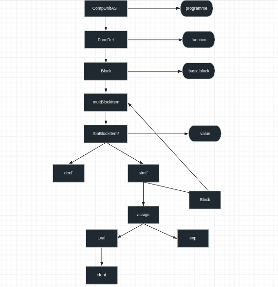

# 词法分析 语法分析

- Flex描述词法部分，需要使用的为.l文件
- Bison描述语法部分，需要使用的为.y文件
  
```C
// 这里写一些选项, 可以控制 Flex/Bison 的某些行为

%{

// 这里写一些全局的代码
// 因为最后要生成 C/C++ 文件, 实现主要逻辑的部分都是用 C/C++ 写的
// 难免会用到头文件, 所以通常头文件和一些全局声明/定义写在这里

%}

// 这里写一些 Flex/Bison 相关的定义
// 对于 Flex, 这里可以定义某个符号对应的正则表达式
// 对于 Bison, 这里可以定义终结符/非终结符的类型

%%

// 这里写 Flex/Bison 的规则描述
// 对于 Flex, 这里写的是 lexer 扫描到某个 token 后做的操作
// 对于 Bison, 这里写的是 parser 遇到某种语法规则后做的操作

%%

// 这里写一些用户自定义的代码
// 比如你希望在生成的 C/C++ 文件里定义一个函数, 做一些辅助工作
// 你同时希望在之前的规则描述里调用你定义的函数
// 那么, 你可以把 C/C++ 的函数定义写在这里, 声明写在文件开头

```

C++语法部分讲解：

```C++
class BaseAST {
 public:
  virtual ~BaseAST() = default;
};
```
以上的代码定义了一个BaseAST类，这个类其实是一个抽象类（对应Java）
virtual函数是个虚函数，必须重写，default表示默认调用编译器生成的析构函数
~表示的是析构函数，是回收的时候调用的？


```C++
  virtual void Dump() const = 0;
```
* virtual: 这是一个虚函数，意味着它可以在派生类中被重写（override）。

* const: 这个关键字表明这个函数是一个常量成员函数，即它不能修改对象的任何数据成员。
* = 0: 这表示这是一个纯虚函数。纯虚函数是一种特殊类型的虚函数，在基类中声明但不提供实现（即没有函数体）。派生类必须提供该函数的实现，除非派生类也是抽象类。

C++中有一种向量类型，这里给出方法
```C++
#include <vector>
std::vector<int> myVector;
myVector.push_back(1);
myVector.push_back(2);
myVector.push_back(3);
int firstElement = myVector[0]; // firstElement 现在是 1
int secondElement = myVector.at(1); // secondElement 现在是 2
int size = myVector.size(); // size 现在是 3
myVector.pop_back(); // myVector 现在只包含元素 1 和 2
myVector.clear(); // myVector 现在是空的
```
以上是一些vector的用法

同时这里也需要添加一种键指对的方法。
unordered_map是C++标准库中的一个容器，它存储键值对，其中每个键都是唯一的。这个容器提供了快速的查找、添加和删除操作。

在内部，unordered_map使用哈希表来实现。因此，它的元素并不按照任何特定的顺序排列，而是根据其键的哈希值进行组织。这就是为什么它被称为"无序"映射。

下面是一个简单的unordered_map使用示例：

```cpp

#include <iostream>
#include <unordered_map>

int main() {
    std::unordered_map<std::string, int> ages;
    ages["Alice"] = 20;
    ages["Bob"] = 21;

    std::cout << "Alice is " << ages["Alice"] << " years old." << std::endl;
    std::cout << "Bob is " << ages["Bob"] << " years old." << std::endl;

    return 0;
}
```
在这个例子中，我们创建了一个unordered_map，其中键是字符串（人名），值是整数（年龄）。然后，我们可以通过键直接访问和修改对应的值。


unique_ptr

有关测例的问题，这里给出一些说明：

测试有关内容分析：
  koopa测试
```shell
./build/compiler -koopa hello.c -o hello.koopa
koopac hello.koopa | llc --filetype=obj -o hello.o
clang hello.o -L$CDE_LIBRARY_PATH/native -lsysy -o hello
./hello
```
  riscv测试
```shell
./compiler -riscv hello.c -o hello.S
clang hello.S -c -o hello.o -target riscv32-unknown-linux-elf -march=rv32im -ma
ld.lld hello.o -L$CDE_LIBRARY_PATH/riscv32 -lsysy -o hello
qemu-riscv32-static hello

```

riscv程序调试
详细见：
    [调试 RISC-V 程序](https://pku-minic.github.io/online-doc/#/misc-app-ref/environment)



目前来看需要完成中端到后端的一个转换
但是如何完成呢？

首先中端生成的是AST,是一个BaseAST返回的一个语法树，
但是后端要求的是一个图，这两个该如何转换？
1、 首先koopa代码的生成还是比较重要的，至少决定了之后要生成的模式是什么样子的。
2、 从目前来看，我们的目标就是要完成lv5的生成是主要目标
在lv5及以前，应该只有一个basic block,这样的情况下就是说从func到basic
block都是树型甚至是线形的，但是value之间存在着图之间的关系
3、 我的想法是func和basic block按照遍历的规则直接生成，但是对于Value来说，在输出koopa的地方，所有的东西完备，就可以进行输出了
4、 具体实现的时候，还可能需要一个map记录中间变量的使用，到时候可以直接调用
5、 但是由于目前不太清楚内存变量的情况，所以这里我们依旧从lv1开始，从表达式一直到后面的常量变量，再到作用域
6、 就按照lxh的生成代码接着生成就完成了